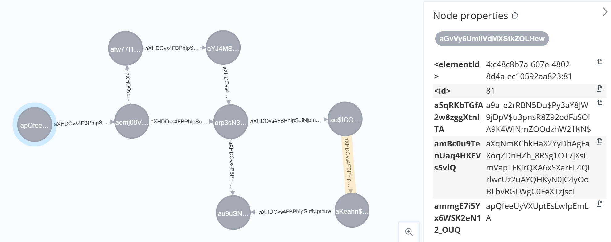
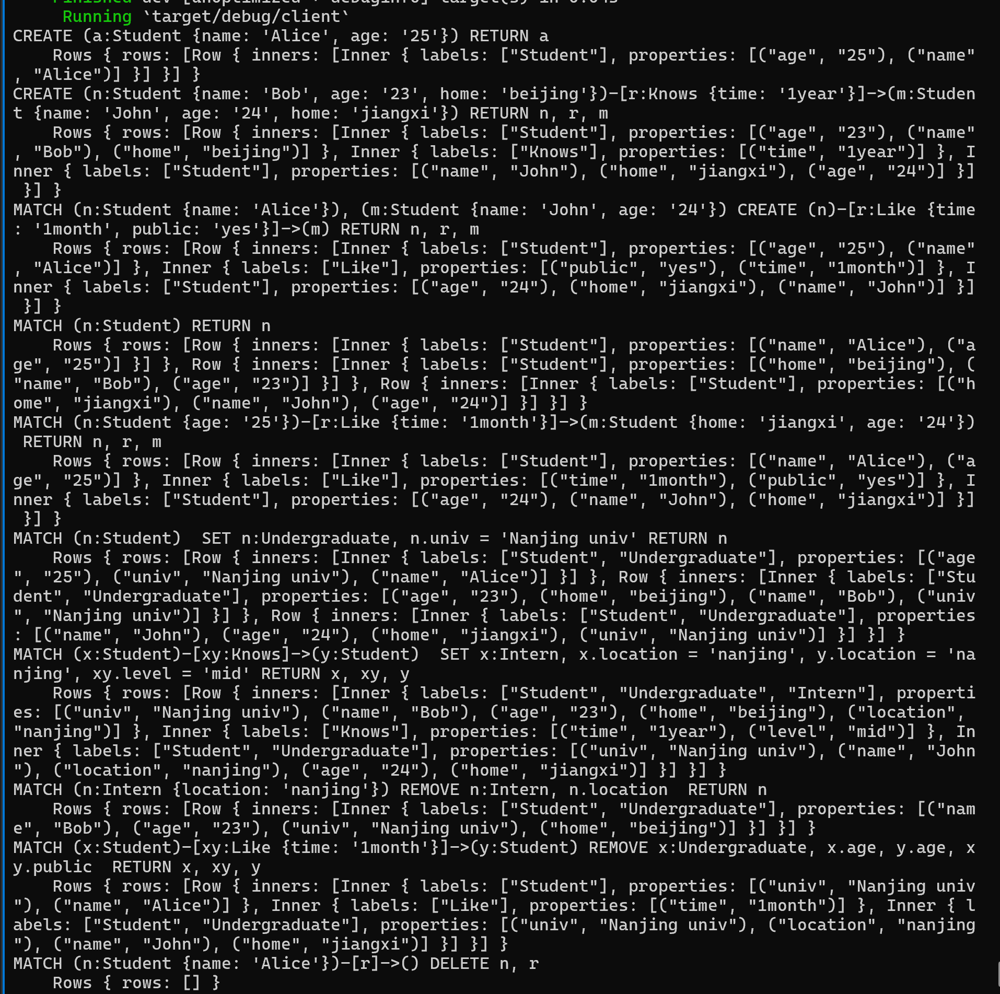
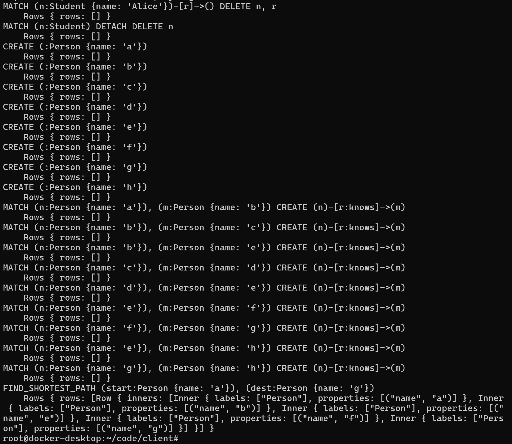

## Clique Task

### 问题描述
设计实现一个基于 Intel SGX 的图数据库系统，保证图查询操作的完整性和机密性。

1. 图查询操作在 enclave 中进行
2. 保证 client 和 enclave 之间的通信安全
3. 系统支持 CRUD 操作，即 Create, Read, Update, Delete
4. 数据库底层使用 neo4j
5. 支持计算最短路，计算过程在 enclave 中进行
6. 基于 SGX Sealing 进行数据加密和持久化
7. 加载图数据时进行数据完整性验证

### 问题分析
设计一个安全的系统，保证数据的完整性和机密性，首先可以分析数据所处的各个阶段，对各个阶段的数据进行分别保护。

#### Data in memory
保护内存中的数据，这是 TEE 最擅长的，enclave 中的数据是受保护的，可以保证其中数据的完整性和机密性。

#### Data in transit
保护传输中的数据，数据会通过网络传输，分为两个部分：
1. enclave 和 neo4j 数据库之间：使用加密通信，比如 bolt
2. enclave 和 client 之间：使用加密通信，比如 tls

#### Data at rest
保护持久化存储中的数据，即数据必须进行加密后才能保存到 enclave 外的持久化存储中，加密的同时还要保证数据的完整性。

### 威胁模型

#### 可信部分
- enclave
- client：因为 client 是明文数据的来源，如果 client 被攻陷，后面的安全系统毫无意义

#### 不可信部分
- client 和 enclave 之间的网络信道
- enclave 和 neo4j 之间的网络信道
- neo4j 及其持久化存储

#### 攻击者的能力
- 窃听 client 和 enclave 之间的网络信道
- 窃听 enclave 和 neo4j 之间的网络信道
- 查看和修改 neo4j 的持久化存储
- 攻陷 neo4j （或整个 host）获得 neo4j 的完全控制权

### 系统架构与设计


- client: 明文数据的来源，位于移动端等端设备内，用户构建图查询，然后将图查询传输给云端的 enclave 中的 server，图查询计算完成后，server 将计算结果发送回 client，用户完成一次图查询计算
- enclave：
    - server: 负责与 client 之间进行安全通信，并将图查询交给 EncryptedGraph 来执行并获取计算结果。
    - EncryptedGraph：负责通过密码学算法对图查询计算进行机密性和完整性保护，与 neo4j 进行安全通信，将加密后的图查询交给 neo4j 执行。
- neo4j：保存加密后的图数据，响应 EncryptedGraph 的加密后的图查询。

#### 设计考量

##### 图查询要进行什么粒度的加密？

neo4j 使用 cypher 图查询语言，其中顶点和边，都是由若干个标签和若干个属性组成，在图查询中会通过标签、属性、关联关系等进行增删改查。
如果我们将整个节点或边完整加密，那么 neo4j 就无法通过标签、属性、关联关系等执行图查询了，neo4j 本身失去了存在意义。而 neo4j 必须存在，所以我们应该进行细粒度的加密，即对每条标签每条属性进行分别加密，这样 neo4j 就可以根据密文图查询来返回给我们密文结果，我们再解密获得明文结果。

##### neo4j 应该在 enclave 内还是外？

普通版 neo4j 是不支持加密计算、加密存储的，仅支持加密网络通信。
借助 LibOS 以及加密文件系统， neo4j 是有可能可以完整移植到 enclave 中的，但是可能会占用更多资源。重要的一点是，这样做似乎也不符合任务的立意。

##### 如何保证数据完整性？

对 neo4j 的标签、属性等进行逐项加密，本身只能保证机密性，无法保证完整性，被攻陷的 neo4j 可能会返回给我们错误的密文结果、或者部分密文结果、或者将正确的部分密文结果进行一些组合，无论哪种情况，使用不保证完整性的加密算法是无法判断的。

1. 方案1：在使用时将所有图数据都保存在 enclave 内存中，可以保证图数据本身的安全性，对所有图数据计算 Merkle Tree，将 Merkle Tree 的数据维护起来，并加密后持久化保存。在每次系统启动时，读取所有图数据到内存中，并读取 Merkle Tree来验证读取的数据是否正确。由于所有数据都在内存中，所以我们可以直接根据内存数据来计算图查询，自己实现图查询逻辑。
    - 缺点1：neo4j只用来保存数据，neo4j自身还不支持加密，neo4j的存在变得毫无意义，不如直接把图数据保存到加密文件系统
    - 缺点2：为了严格的完整性，必须要保证数据都在实时保护之下，而只有在 enclave 中才能确保这一点，如果数据在 enclave 外，即便现在验证 Merkle Tree 成功，后面数据也可能被修改而不自知，从而失去完整性。这样的解决方案意味着巨大的内存消耗，对于图很大的情况很不友好。
2. 方案2：图数据放在 enclave 外，enclave 内保存所有节点、边的哈希值。这样每次数据从 neo4j 中读取出来，都可以检查该数据的哈希值是否存在于保存的所有哈希值。
    - 缺点1：查询（即过滤）依然是 neo4j 进行的，neo4j 可以只返回部分数据给你、甚至是错误数据给你。例如想要节点A，neo4j却可以返回给我们节点B，仅根据哈希值我们只能判断返回的节点是完整的节点，不能判断是否是正确的节点。
    - 缺点2：难以更新哈希值，第一次创建数据时可以看见全部明文所以可以计算哈希值，后面在修改数据时不能保证拿到正确的节点和边，也就无法计算正确的新哈希值。

可以看到，设计中有很多 trade-off，实现强完整性的开销过大，因为我们设计实现了弱完整性机制:

**原始的明文节点：** 

标签：[plain_label1, plain_label2, ...] 

属性：[(plain_key1: plain_value1), (plain_key2: plain_value2), ...]

**新建节点和边的时候都添加一个唯一的 uid 到属性中，得到** 

标签：[plain_label1, plain_label2, ...] 

属性：[(uid: xxx)， (plain_key1: plain_value1), (plain_key2: plain_value2), ...]

**对所有标签和属性计算哈希值，并把哈希值添加到属性中，得到**

标签：[plain_label1, plain_label2, ...] 

属性：[(hash: xxx)， (uid: xxx)， (plain_key1: plain_value1), (plain_key2: plain_value2), ...]

**对所有标签和属性进行加密并 base64 编码，得到**

标签：[enc_label1, enc_label2, ...] 

属性：[(enc_hash: enc_xxx)， (enc_uid: enc_xxx)， (enc_key1: enc_value1), (enc_key2: enc_value2), ...]

其中，**base64 需要替换其中的特殊符号**，这是因为 neo4j 的图查询有相关命名要求。并且再给所有加密结果**添加一个前缀字母**，来满足 neo4j 的图查询命名要求。

经过这样的处理之后，我们可以保证每个节点本身的机密性完整性，准确的说，保证节点处在某个时刻的完整性，因为我们在更新数据时需要先从 neo4j 获取数据并写回，如果 neo4j 被攻陷，neo4j 返回不完整的结果会被我们发现，但是如果 neo4j 返回旧的结果，我们无法判断。

每次更新数据时都相应修改哈希值并写回，如果 neo4j 假装给我们写回，那么后续我们只能获得旧版本的完整数据。

**特殊处理边的 uid** 

边的 uid 是边的起点和终点的两个节点的 uid 的组合，在新建边的时候可以唯一确定。

这样做是为了在涉及边的图查询时我们可以验证计算的正确性，比如我们查询NODE_A-RELATION_R->NODE_B 的关联关系，就可以通过 uid 来确定 neo4j 返回给我们的结果是否是正确的关联关系，这一点在处理最短路时尤为重要，如果不记录 uid，在计算最短路时 neo4j 就可以随便返回几个完整的节点来假冒真实的最短路。

在 neo4j 中查看图数据如下所示，所有标签和属性都被加密了（包括 uid 和 hash）


### 环境部署与测试

开发环境：docker + neo4j + occlum (Intel SGX LibOS)

1. 配置 docker 环境
2. 配置 .env 环境变量: 在`./`目录下创建 `.env` 文件，内容如下：
```
DATABASE_URI=bolt://127.0.0.1:7687
DATABASE_USERNAME=neo4j
DATABASE_PASSWORD=your_password
NEO4J_AUTH=neo4j/your_password
```
3. 配置 neo4j 的 ssl certificates （neo4j 3.5 以后版本需要配置才能启用加密通信）
```
mkdir -p ./neo4j/certificates/bolt/revoked
mkdir -p ./neo4j/certificates/bolt/trusted

cd ./neo4j/certificates/bolt
openssl req -newkey rsa:2048 -nodes -keyout private.key -x509 -days 365 -out public.crt
```
4. 启动 docker compose
```
docker-compose up -d
```
5. 启动 enclave
```
docker attach occlum
cd ~/code/enclave
./run_tee_app_on_occlum.sh
```
6. 启动 client
```
docker attach client
cd ~/code/client
cargo run
```

**CRUD 操作测试结果**


**最短路 测试结果**
图结构如下所示：
```
            c --> d
            ⬆     ⬇
      a --> b --> e --> f
                  ⬇     ⬇
                  h <-- g
```


### 实现细节

#### 加密算法与哈希算法

加密算法采用 AES-ECB-128，哈希算法采用 BLAKE-3

#### 计算正确的哈希值

neo4j 的标签和属性是乱序的，不保证其内部顺序，因此每次计算哈希值之前，先对标签和属性进行排序再计算。

#### Sealing

有两种方案，一是使用 occlum 的加密文件系统 SEFS，那么保存进去的数据都是默认 Sealing 的。二是从 SGX 获取 key 来做 Sealing，因为是基于面试目的的 task，我实现了第二种方案。

首先通过 occlum 的 ioctl 来调用 `create_report`，获取 `cpu_svn` 等数据，然后再基于这些数据通过 ioctl 调用 `get_key` 来获取 `MRENCLAVE` 模式下的 128 位的 key。

#### 最短路

通过 BFS 实现，首先获取起点终点的 uid，然后将 uid 作为唯一标识来读取边和相邻节点，并且用边的 uid 验证关联关系。
在 BFS 每一步中，获取当前节点的相邻节点及其相连的边，并用得到的 uid 验证关联关系是否正确，将没遇到的新节点加入队列，并保存上一个节点的 uid，用于还原路径。
BFS 找到终点后，再倒退还原路径返回给用户。

#### 构造图查询

直接使用 neo4j 原生的字符串图查询比较复杂，难以提取其中的标签属性进行加密替换，因此实现了 `simple-cypher` crate，用于以操作链的方式构建图查询，并支持序列化反序列化，以及生成 neo4j 原生图查询。


#### 混淆图查询中的变量名

`MATCH (alice:Label), (bob:Label) CREATE (alice)-[like:TYPE]->(bob)`, 用户提供的图查询的变量名中可能包含敏感信息，在执行图查询之前，统一对图查询中的变量名进行处理，映射为无敏感数据的变量名。

#### 将原生图查询拆解为多段进行
例如 `MATCH (n:Label), (m:Label) CREATE (n)-[r:TYPE]->(m)`，创建新的边，在执行过程中，拆解为：
1. `MATCH (n:Label), (m:Label) RETURN n, m`，获取符合条件的节点，根据其 uid 构造新边的 uid
2. `MATCH (n:Label), (m:Label) CREATE (n)-[r:TYPE { uid: xxx, hash: xxx}]->(m)`，构造好 uid 和 hash 后再构造新的图查询并执行

在 `SET` 和 `REMOVE` 中也有类似机制，更新数据之前先读取数据，然后构造好 hash，再将 hash 添加到图查询中并执行

#### client 和 server 之间的加密通信

使用 tokio + tls，具体是 `tokio_rustls` crate 实现，编写了 client 和 server 之间双向互认的代码逻辑，但是 `tokio_rustls` 似乎不支持自签名证书，而我也没有第三方CA来签证书，未能通过测试，实际代码中注释掉了 tls 相关逻辑。