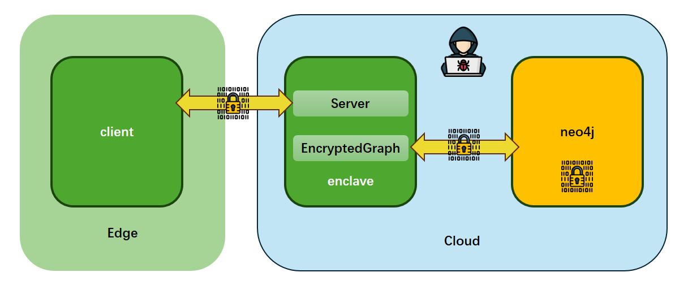

## Clique Task

### 问题描述
设计实现一个基于 Intel SGX 的图数据库系统，保证图查询操作的完整性和机密性。

1. 图查询操作在 enclave 中进行
2. 保证 client 和 enclave 之间的通信安全
3. 系统支持 CRUD 操作，即 Create, Read, Update, Delete
4. 数据库底层使用 neo4j
5. 支持计算最短路，计算过程在 enclave 中进行
6. 基于 SGX Sealing 进行数据加密和持久化
7. 加载图数据时进行数据完整性验证

### 问题分析
设计一个安全的系统，保证数据的完整性和机密性，首先可以分析数据所处的各个阶段，对各个阶段的数据进行分别保护。

#### Data in memory
保护内存中的数据，这是 TEE 最擅长的，enclave 中的数据是受保护的，可以保证其中数据的完整性和机密性。

#### Data in transit
保护传输中的数据，数据会通过网络传输，分为两个部分：
1. enclave 和 neo4j 数据库之间：使用加密通信，比如 bolt
2. enclave 和 client 之间：使用加密通信，比如 tls

#### Data at rest
保护持久化存储中的数据，即数据必须进行加密后才能保存到 enclave 外的持久化存储中，加密的同时还要保证数据的完整性。

### 威胁模型

#### 可信部分
- enclave
- client：因为 client 是明文数据的来源，如果 client 被攻陷，后面的安全系统毫无意义

#### 不可信部分
- client 和 enclave 之间的网络信道
- enclave 和 neo4j 之间的网络信道
- neo4j 及其持久化存储

#### 攻击者的能力
- 窃听 client 和 enclave 之间的网络信道
- 窃听 enclave 和 neo4j 之间的网络信道
- 查看和修改 neo4j 的持久化存储
- 攻陷 neo4j （或整个 host）获得 neo4j 的完全控制权

### 系统架构与设计

